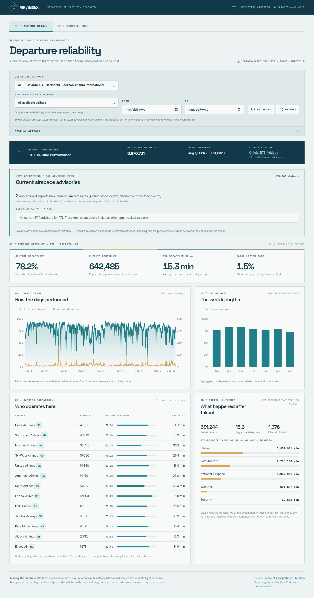
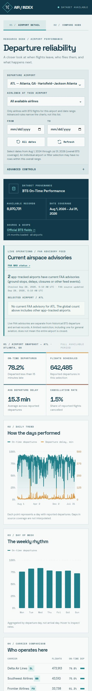
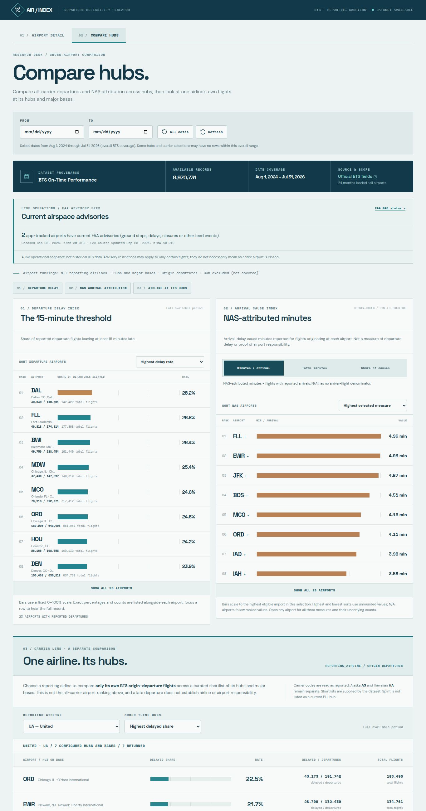
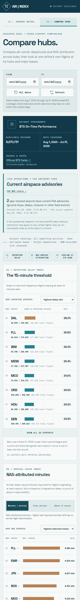

# AIR / INDEX

**A dashboard for exploring flight delays and cancellations at 32 U.S. departure airports, including major airline hubs and bases.**

AIR / INDEX combines 24 months of official U.S. Bureau of Transportation Statistics (BTS) on-time performance data with current Federal Aviation Administration (FAA) airport advisories. You can look at one airport in detail or compare delay patterns across hubs, airlines, days of the week, and months.

This is an analytical tool for exploring historical patterns. It is not a live flight tracker and it does not predict future delays.

## Why I built this

I used to be an air traffic controller, so I spent years seeing delays from the tower side. After reading about new AI tools for air traffic flow management, I got curious how delays actually break down across the major airline hubs from the airline side. This project was my way of finding out.

## Screenshots

Each dashboard view is shown twice: **desktop** shows the wide layout, and **mobile** shows how the *same view* rearranges for a phone. These are screenshots of the running app; totals and FAA advisories may change as the underlying data updates. Click an image to see it at full size.

### Airport detail

**Desktop view (1365 px wide)**

**Mobile view (402 px wide)**

### Compare hubs

**Desktop view (1365 px wide)**

**Mobile view (402 px wide)**

## Key findings

These are results from the imported BTS data covering **August 2024 through July 2026**. They describe flights departing the 32 tracked airports; they are not nationwide measures. The data and estimates below are a snapshot of that period even if the dashboard later imports more months.

- **Late aircraft was the largest delay category.** It made up **39.5% of the five attributed arrival-delay categories' combined minutes**, ahead of carrier (**33.6%**) and NAS—the National Airspace System (**20.9%**). Delays passed from one flight to the next were the biggest single category of attributed minutes.
- **Airports ranked differently depending on the measure.** Dallas Love Field had the highest delayed-departure share (**28.2%**) but relatively low NAS-attributed delay (**2.33 minutes per arrival**). JFK had a lower delayed-departure share (**20.7%**) but higher NAS-attributed delay (**4.87 minutes per arrival**). Honolulu had the lowest delayed-departure share (**13.7%**).
- **Delays varied by weekday and month.** Sunday departures were delayed most often (**26.0%**) and Tuesday departures least often (**18.6%**). Pooling the same calendar month across both observed years, July had the highest delayed-departure share (**31.0%**) and September the lowest (**16.8%**).
- **Performance got worse between the two 12-month periods.** Delayed-departure share rose from **21.4% to 23.7%**, and cancellation rate from **1.32% to 1.87%**, comparing August 2024–July 2025 with August 2025–July 2026. The change was not uniform: Dallas Love Field and Fort Lauderdale each worsened by more than six percentage points, while Houston Intercontinental improved.
- **Cancellations were concentrated.** DCA and LaGuardia had the highest cancellation rates (about **3.6%**) and Salt Lake City the lowest (**0.57%**). January 24–27, 2026 accounted for **75% of that January's cancellations**; on January 25, nearly half of reported flights from the tracked airports were cancelled.

## What this suggests

These are **hypotheses, not conclusions the data proves**. BTS reports arrival-delay causes in broad categories and does not show exactly why any particular flight was late or cancelled.

- **Different airports may need different solutions.** Dallas Love Field's high departure-delay share alongside lower NAS minutes raises questions about airline operations, turnarounds, and late incoming aircraft. JFK's higher NAS minutes raises questions about airspace and traffic flow. The aggregate data alone cannot confirm either explanation.
- **The ripple effect matters.** Because late aircraft is the largest attributed category, predicting and managing disruptions earlier in the day *might* reduce delays that pass to later flights. This dataset does not measure what a specific intervention would save.
- **Peak days and months may leave less room to absorb problems.** Sundays and July had higher delay rates. Demand and summer thunderstorms are possible contributors worth testing with additional data, not causes established by this dashboard.

## Estimated cost of delays (guesstimates)

Everything in this section is a **rough illustration, not a measured result or forecast**. The dataset reports delay minutes and cancellations, not costs. The dollar estimates depend entirely on the assumptions below; do not add the scenarios together as though they were independent losses.

### Assumptions

- The five attributed arrival-delay categories total about **138 million minutes over 24 months**, or roughly **69 million minutes per year**, for flights departing the 32 tracked airports.
- Assume an average airline cost of **$75 per attributed delay minute** for crew, fuel, and aircraft time. This is an illustrative input, **not a cost measured by BTS**, and it excludes passenger costs.
- Assume **$10,000–$20,000 per cancelled flight** for lost revenue, rebooking, refunds, and repositioning aircraft and crews. This is also an illustrative input, not a measured cancellation cost.

### Guesstimated results

- At $75 per attributed minute, the illustrated airline delay cost is roughly **$5 billion a year** for these flights.
- If the assumed cost scaled directly with preventable minutes, a **5% reduction** would represent roughly **$250 million a year**, and a **10% reduction** roughly **$500 million**.
- Applying the observed rise in cancellation rate to roughly 4.5 million reported flights per year is equivalent to approximately **24,000 additional cancellations a year**, or **$240 million–$480 million** at the assumed cost per cancellation. This is a comparison of two periods, not a forecast.
- January 24–27, 2026 had **12,500 cancellations** in the tracked data; at the assumed cost per cancellation, that four-day disruption illustrates **$125 million–$250 million**.

### Possible impact on crews (not measured)

This dataset does not include crew information, so these are possible effects rather than results. When delays and cancellations stack up, pilots and flight attendants can reach legal duty-time limits. Airlines may then call in reserve crews, rebook hotels, and reposition crews and aircraft that end up in the wrong cities. Fewer disruptions would likely mean less of that extra cost for airlines and more predictable schedules for crews, with fewer extended days and last-minute changes.

## What the dashboard does

### Airport detail

- Pick any of the 32 supported airports, one or more reporting airlines, and a date range.
- See on-time departure percentage, flight counts, average departure delay, and cancellation rate.
- View daily trends, day-of-week patterns, a breakdown of airlines operating at the airport, and what happened to those flights after departure, including arrival-delay minutes by cause.
- Choose which summary metrics and monthly trends to display.
- See any current FAA advisories for the selected airport, with the time of the last check.

### Compare hubs

- Rank airports by delayed-departure share.
- Rank airports by NAS-attributed arrival-delay minutes per arrival, total NAS minutes, or NAS share of all attributed cause minutes.
- Compare one reporting airline's performance across its curated hubs and major bases.

Supported airports: `ATL`, `DFW`, `DEN`, `ORD`, `LAX`, `JFK`, `LGA`, `EWR`, `SFO`, `SEA`, `CLT`, `PHX`, `MIA`, `PHL`, `DCA`, `IAD`, `IAH`, `DTW`, `MSP`, `SLC`, `BOS`, `PDX`, `ANC`, `HNL`, `DAL`, `HOU`, `MDW`, `BWI`, `LAS`, `MCO`, `FLL`, and `SJU`.

## How it works

A Java service downloads official BTS monthly flight data, keeps the fields this app needs, and stores daily totals by airport and airline in PostgreSQL. It checks for newly published months on startup and at 05:00 UTC each day while running—not only on the 5th of the month.

The same service checks the FAA airport-status feed about every 15 minutes while running and saves each successful result. If the feed is unavailable or out of date, the dashboard says so instead of showing old information as current.

The dashboard is built with HTML, CSS, and JavaScript using Vite, with responsive charts for desktop and mobile. It requests its data from the Java API.

Detailed information about controls, source fields, calculations, the database, API routes, and running the project is in the [technical reference](docs/technical-reference.md). See also the [BTS data and SQL notes](docs/bts-data.md), [database schema](docs/database-schema.md), and [Java/API operations](docs/java-postgresql.md).

## Data sources

- [BTS Reporting Carrier On-Time Performance](https://www.transtats.bts.gov/ONTIME/) from the U.S. Department of Transportation's TranStats: public monthly records for individual flights reported by covered carriers.
- [FAA National Airspace System Status](https://nasstatus.faa.gov/api/airport-status-information): the FAA's public feed of current ground stops, ground delay programs, restrictions, and closures.

No third-party or paid **flight-data feed**, and no invented flight records, are used.

## Limitations

- **Historical data has a lag.** BTS publishes monthly after the month ends; the dashboard only shows months successfully imported. Source publication timing can vary.
- **Delay causes are broad categories.** They are reported by carriers; weather and NAS attribution can involve judgment, and the five categories do not explain every arrival-delay minute.
- **The view is departure-based.** Arrival results describe flights leaving the selected airport, not all flights arriving there. They do not prove that the departure airport caused a delay.
- **Reporting carriers are not always marketed brands.** A regional carrier may report flights flown for a larger airline brand.
- **FAA advisories are current snapshots**, not linked to historical BTS flights.
- **Two years suggest patterns**, but cannot establish long-term trends.
- **The hub list is curated for this project**, not an official designation of hub status.

## Roadmap

Ideas for expanding the project:

- Add ground-stop and delay-program history from FAA Command Center advisories.
- Add weather data from METARs and TAFs to connect delays with actual conditions.
- Add hour-of-day patterns using flight-level data.
- Estimate delay risk from weather forecasts to help with planning ahead.
- Show how delays cascade into later flights, aircraft positioning, and crew schedules.

## How I built it

This project was built primarily with AI coding tools on Replit. I chose the idea, the data sources, and the features, and directed the build.