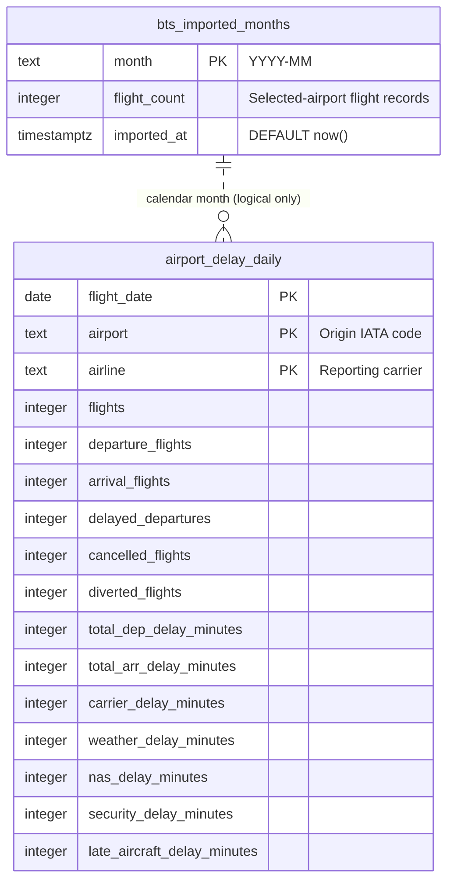

# Airport Delay Dashboard — database schema

The development PostgreSQL database contains two tables in the `public` schema. The diagram below is editable Mermaid source; the SVG above is a viewable copy.

## Keys and relationship

| Table | Primary key | Other index |
|---|---|---|
| `airport_delay_daily` | (`flight_date`, `airport`, `airline`) | `airport_delay_airport_date_idx` on (`airport`, `flight_date`) |
| `bts_imported_months` | `month` | None beyond its primary-key index |

**The dotted relationship is conceptual, not a database foreign key.** `bts_imported_months.month` is text in `YYYY-MM` form. An aggregate row belongs to a month when `to_char(airport_delay_daily.flight_date, 'YYYY-MM') = bts_imported_months.month`. PostgreSQL does not enforce this relationship, and the importer writes the month's aggregate rows and import marker in one transaction.

Every column in both tables is `NOT NULL`. Only `bts_imported_months.imported_at` has a default (`now()`). There are no separate airport or airline dimension tables: codes are stored directly on the daily fact rows. Each fact row represents all BTS-reported flights for **one origin airport, date, and reporting carrier**, not an individual flight. For the source-field mapping and calculation definitions, see [BTS data and SQL model](./bts-data.md).