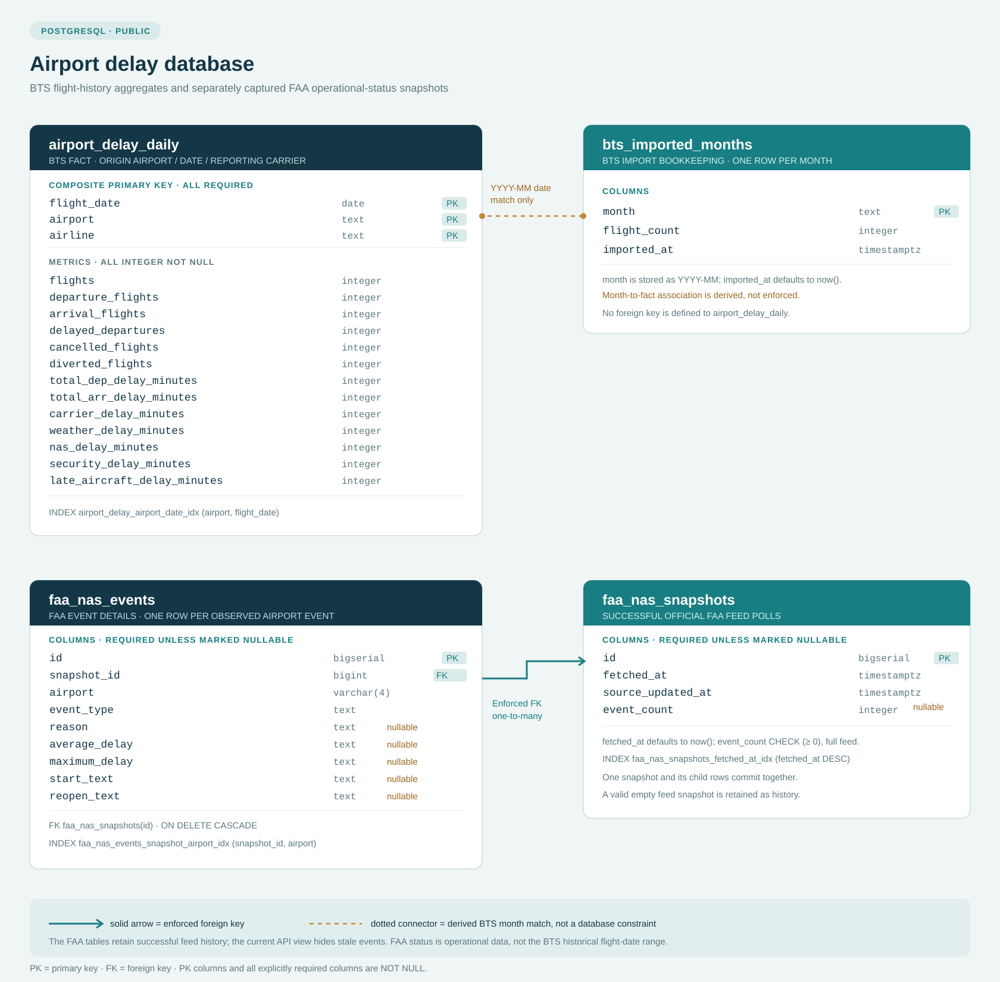
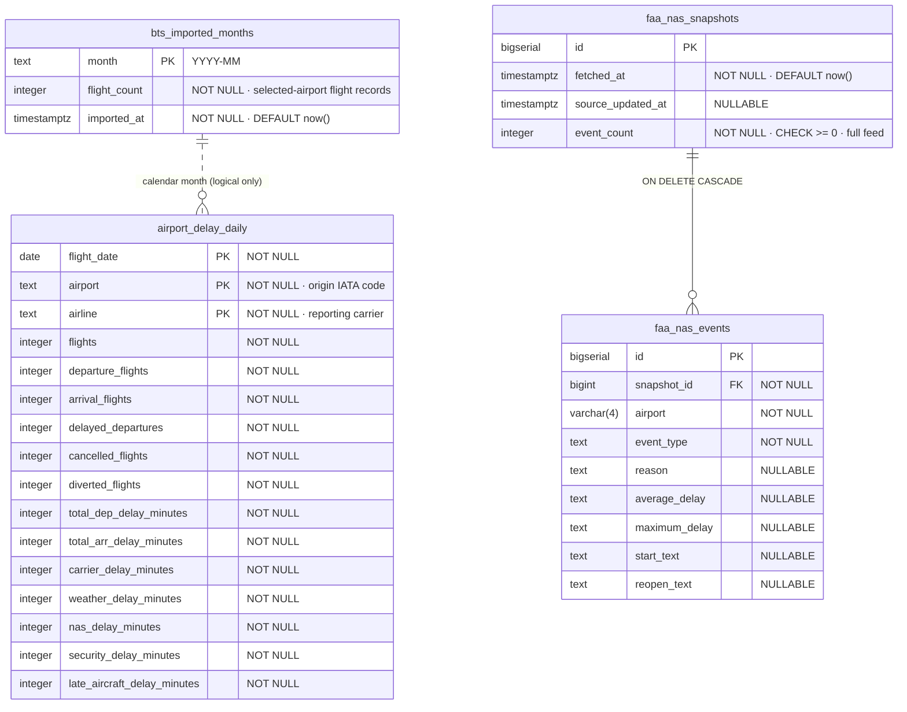

# Airport Delay Dashboard — database schema

The PostgreSQL database contains four tables in the `public` schema. The diagram below is editable Mermaid source; the SVG above is a viewable copy.

## Keys and relationship

| Table | Primary key | Other index |
|---|---|---|
| `airport_delay_daily` | (`flight_date`, `airport`, `airline`) | `airport_delay_airport_date_idx` on (`airport`, `flight_date`) |
| `bts_imported_months` | `month` | None beyond its primary-key index |
| `faa_nas_snapshots` | `id` | `faa_nas_snapshots_fetched_at_idx` on (`fetched_at` DESC) |
| `faa_nas_events` | `id` | `faa_nas_events_snapshot_airport_idx` on (`snapshot_id`, `airport`) |

**The dotted relationship is conceptual, not a database foreign key.** `bts_imported_months.month` is text in `YYYY-MM` form. An aggregate row belongs to a month when `to_char(airport_delay_daily.flight_date, 'YYYY-MM') = bts_imported_months.month`. PostgreSQL does not enforce this relationship, and the importer writes the month's aggregate rows and import marker in one transaction.

`faa_nas_events.snapshot_id` has a real, enforced foreign key to `faa_nas_snapshots.id` with `ON DELETE CASCADE`; removing a snapshot also removes its event rows. Snapshot/event records form a history of successful feed polls, not an independent archive of FAA advisories. A successful poll inserts one snapshot and all its event rows in the same transaction, even when the feed contains no airport events. Poll or parse failures do not insert an empty snapshot or erase history.

In `faa_nas_snapshots`, `source_updated_at` is nullable; all other columns are `NOT NULL`, and `fetched_at` defaults to `now()`. `event_count` is constrained to be nonnegative and counts all events in the full feed, including airports not tracked in the dashboard. In `faa_nas_events`, `reason`, `average_delay`, `maximum_delay`, `start_text`, and `reopen_text` are nullable; the remaining columns are `NOT NULL`. `airport` is limited to `VARCHAR(4)`. Event type and explanatory details remain text as supplied by the FAA rather than being normalized into invented status codes.

## Schema setup and deployment

The development database already has the FAA tables, and their schema has been verified. The Java service verifies the required tables at startup; it does not issue table-creation DDL. `artifacts/api-server/java/db/001_faa_nas_status.sql` is the checked-in FAA schema source for an app-only GitHub clone or local setup. It is **not** a deploy-time migration script.

For Replit Publish, the development and production PostgreSQL schemas are compared so that the FAA tables can be added to the production schema through the Publish workflow. Do not execute this SQL file directly against the production database or use application startup to alter the production schema.

The current FAA view is derived from the latest stored successful snapshot and limited to the dashboard's supported airports. `/api/nas-status` reports `unavailable` before the first successful poll and `stale` when the fetch or parseable FAA source-update time is older than 30 minutes. In those cases it withholds old events instead of presenting them as current or as an all-clear. Previous successful snapshots remain queryable in the database. This live FAA status history is separate from the BTS flight-performance fact table and its historical date coverage.

All columns in both BTS tables are `NOT NULL`. Only `bts_imported_months.imported_at` has a default (`now()`). There are no separate airport or airline dimension tables: codes are stored directly on the daily fact rows. Each fact row represents all BTS-reported flights for **one origin airport, date, and reporting carrier**, not an individual flight. For the source-field mapping and calculation definitions, see [BTS data and SQL model](./bts-data.md).